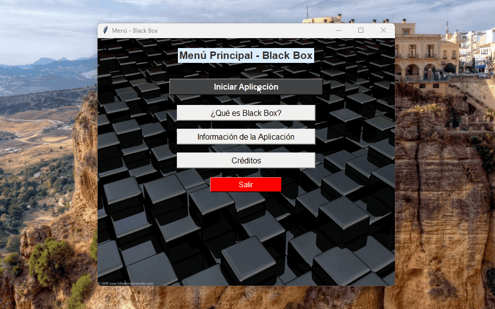

# Blackbox S - Análisis de Red Neuronal Caja Negra

Este proyecto consiste en una herramienta interactiva desarrollada en Python para analizar el comportamiento de la red neuronal **Blackbox S**, un modelo de tipo caja negra que realiza clasificación binaria en un dominio bidimensional.

## 🧠 Descripción

La red **Blackbox S** acepta dos valores numéricos como entrada y devuelve una salida binaria (`0.0` o `1.0`), sin exponer su estructura interna. El objetivo de este proyecto es explorar empíricamente su comportamiento a través de visualización y muestreo sistemático, con el fin de inferir la posible frontera de decisión del modelo.

## 🎯 Objetivos

- Analizar el comportamiento de la red neuronal a partir de sus salidas.
- Diseñar una interfaz gráfica amigable para ingreso de datos y visualización.
- Aplicar técnicas de muestreo para explorar visualmente la frontera de decisión.

## 🛠️ Tecnologías y Herramientas

- Python 3.x
- TensorFlow / Keras (para cargar el modelo)
- Matplotlib / Seaborn (para visualización)
- Tkinter (para la interfaz gráfica)
- Visual Studio Code
- Git y GitHub (control de versiones)

## 📈 Metodología

1. **Carga del modelo**: Se carga el modelo previamente entrenado (formato `.h5`).
2. **Validación de entrada**: Se permite ingresar valores `x1`, `x2`, validando que `x1 ≥ 0`.
3. **Evaluación del modelo**:
   - Evaluación individual: `predict_point(model, x1, x2)`
   - Evaluación en lote: `predict_batch(model, x1s, x2s)`
4. **Visualización**: Se grafican los resultados para evidenciar regiones del plano clasificadas como `1` o `0`.

## 🔍 Ejemplo de uso

```python
# Cargar modelo
model = load_model("blackbox_s_model.h5")

# Ingresar valores
x1 = 1.5
x2 = -2.3

# Realizar predicción
output = predict_point(model, x1, x2)
print("Clasificación:", output)

# Visualizar el punto
graficar_punto(x1, x2, output)
```

## 📊 Resultados
Clasificación binaria visual de los puntos ingresados.

Mapa de calor del dominio de entrada mostrando las regiones por clase.

Identificación de patrones no lineales en la frontera de decisión.

## ✅ Conclusiones
Se logró analizar un modelo de caja negra únicamente observando sus salidas.

La visualización fue crucial para inferir el comportamiento del clasificador, pese a no conocer su estructura interna.

## 🎬 Demostración


## 🚀 Código principal

[Ir al script principal](Blackbox/Aplicacion_BlackBox.py)


## 👥 Autores
Dany Molina

Kevin Gómez

Joseph Jiménez

Catedrático: Ing. Jonathan Zea
Asignatura: Métodos Numéricos – Escuela Politécnica Nacional
Fecha: 16/06/2025